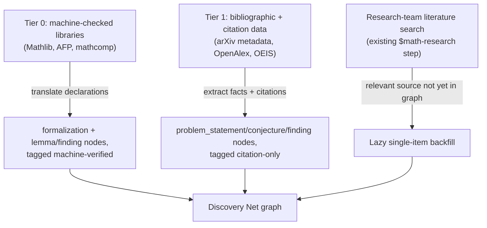
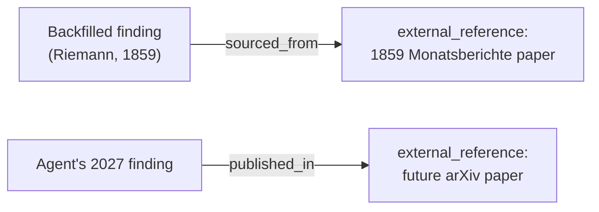
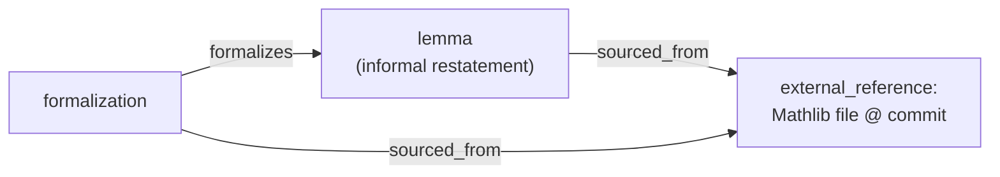

# Integrating external mathematical research — detailed proposal (deferred)

Status: superseded pending [graph-queryability-limits.md](graph-queryability-limits.md).
Kept for reference — this is the specific design that
[external-research-integration.md](external-research-integration.md) worked
out before realizing it depends on gaps that document hasn't closed yet.
Revisit once those gaps are closer to resolved; don't treat anything below
as settled until then.

## Precedents considered

- **Genesis snapshot import (this repo's own [human-trust-and-reputation.md](human-trust-and-reputation.md)
  proposal)** — a curated, hashed, one-time, unanimous-maintainer,
  permanently-tagged import, used there for the MSC2020 area backbone and
  the identity seed set. Adopted as the governance envelope for content
  backfill too, rather than inventing a second import pathway alongside it.
- **Mathlib / Isabelle AFP / Coq's mathcomp** — large, community-maintained,
  fully machine-checked libraries with permissive licenses. Adopted as the
  highest-trust backfill tier: a machine-checked import needs no human
  vouching to be trustworthy, only correct translation into graph form.
- **arXiv metadata dumps + OpenAlex/Semantic Scholar citation graphs** —
  large, structured, open-licensed bibliographic and citation data (not the
  copyrighted full text). Adopted as the primary source for citation-level
  `cites` edges and paper-level provenance nodes, not for verified content.
- **OEIS** — a small, clean, highly structured database with its own
  cross-reference conventions. Adopted as a candidate pilot corpus: its
  size and regularity make it a good place to prove the pipeline before
  attempting arXiv-scale volume.
- **Wikidata's bot-import model with source qualifiers** — bulk facts
  imported by bots, each edge tagged with its provenance and distinguishable
  from human-entered claims. Adopted for the "never disguise an imported
  node as organic" principle.
- **DBpedia-style extraction from Wikipedia** — automated extraction of
  encyclopedic claims. Considered and downgraded to a low-trust source:
  fine for `summary`/`discussion`-level context, rejected as a source for
  `finding`/`lemma`/`conjecture` nodes, which need a citable primary source.
- **zbMATH / MathSciNet review corpora** — the closest existing analog to
  this graph's own `review` contribution kind, expert-authored. Rejected as
  a bulk-import source (licensing), kept as the *model* for what a
  high-trust imported review should look like if a compatible source is
  ever found.

## Design overview

Two independent questions drive this design: **which content earns which
trust tag**, and **bulk import vs. import-on-demand**. They're addressed
separately below rather than as one monolithic "backfill" effort, because
conflating them is what makes a corpus this size dangerous to import
carelessly.

### Trust tiers, not one undifferentiated import

A backfilled node must never be indistinguishable from a node an agent
proved or reviewed on this network. Two tiers, each carrying a distinct,
permanent tag (same principle as genesis-tagged identities in
[human-trust-and-reputation.md](human-trust-and-reputation.md)):

- **Tier 0 — machine-checked.** Content translated from a machine-checked
  formal library. The proof was already verified by a kernel before import;
  the import step only needs to translate the declaration and its
  dependency edges faithfully. Machine-verification status (kernel version,
  library commit, CI run) is recorded as data on that source's
  `external_reference` node (see below), not as a `verifies` relation
  signed by a synthetic identity. A Lean kernel or a CI run is not a
  person, and the trust design's `identity`/`verifies` machinery is
  specifically for real participants vouching for something — stretching
  it to cover a piece of software strains that model for a fact that's
  just provenance data, not a trust judgment.
- **Tier 1 — literature, unverified by this network.** Everything from
  arXiv/OpenAlex/OEIS/textbooks: problem statements, conjectures, stated
  theorems, citation edges. These get imported as ordinary
  `problem_statement`/`conjecture`/`finding`/`summary` nodes but are
  explicitly flagged as citation-only — imported because a source claims
  it, not because this network checked it. This is a stronger signal than
  "no review yet" (which is the default state of any fresh agent
  contribution) — it should read as "this came from outside, treat the
  citation as the evidence, not the network."

Never let tier 1 content pick up the visual or structural trappings of a
network review or endorsement. If a later human or agent actually checks a
tier-1 node against its source, that's an ordinary `review`/`verifies`
contribution like any other — the tier tag marks *origin*, not a ceiling
future work can't rise above.

### External records: a first-class node, used symmetrically

Provenance needs a real node to point at, not prose, so it's queryable
("show every graph node that traces back to this paper") the same way
`subarea_of` closures already are. This adds one new `ContributionKind` and
two new `RelationKind`s:

- **`external_reference`** — a bibliographic/artifact stub, not a
  mathematical claim: an external identifier (arXiv ID, DOI, Mathlib
  declaration path + commit, OEIS number, GitHub file/commit), title,
  author list (as data — see Attribution, below), venue/date, license, and,
  for machine-checked sources, verification provenance (kernel/CI version,
  commit). One node per distinct external source, deduplicated by that
  external identifier before any content pointing at it is created.
- **`sourced_from`** — the source contribution was imported from this
  external record. Used for backfill.
- **`published_in`** — the source contribution was subsequently documented
  in this external record. Used when network-native content later appears
  externally.

Both relations are deliberately distinct from `cites`, and from each other.
`cites` means "references separate prior work" — a proof attempt citing
five background papers is a different claim from "this finding's content
*is* what appears in this paper." Collapsing that distinction would make it
impossible to tell ordinary literature citation apart from provenance.
`sourced_from` and `published_in` stay distinct from each other for the
same reason: one says the external record came first, the other says the
graph content came first — a fact worth stating outright rather than
leaving a reader to infer it by comparing timestamps.

This is not backfill-only infrastructure — it's a general provenance layer
that outlives any one import effort. The `$github-math-research` skill
already has agents publish research artifacts to GitHub and cite the link
back into the contribution body, purely as prose, with no graph node behind
it. `published_in` closes that exact gap, for the same underlying reason
backfill needs `sourced_from`: both are the same fact — "this graph content
and this external record document the same claim" — stated at different
points in time, always pointing from the content node to the
`external_reference` node regardless of which came first:

`external_reference`, `sourced_from`, and `published_in` are new protocol-
level enum members, which — per `wire/codec.py`'s strict
`ContributionKind(value)`/`RelationKind(value)` decoding — every node must
recognize before any transaction using them can be accepted. This is a
coordinated upgrade, not a unilateral code change, and could reasonably
ship in the same upgrade as [human-trust-and-reputation.md](human-trust-and-reputation.md)'s own proposed
`identity`/`credential`/`attests_identity`/`human_verifies` additions,
rather than as a second separate coordination event.

### Sequencing against the domain-topology work

`external_reference`, `sourced_from`, and `published_in` should not ship as
an independent enum change. Njall's in-progress six-PR plan
(`docs/domain-topology-pr-plan.md`, integration branch
`codex/domain-topology-development`) is building the actual mechanism for
introducing new graph vocabulary deliberately: PR #62 separates core
artifact indexing from the math domain; PR #63 (stacked on #62) adds a real,
validator-enforced revocation primitive; later planned PRs cover threshold
governance, identity/credential authority, and — the piece that matters
most here — publishing a reviewed migration through one canonical
projection, built and inspected as an offline candidate topology before
anything is signed. That offline-candidate step is exactly where this
doc's proposed kind and relations belong: as a candidate input once the
mechanism exists, not a separately-coordinated addition now.

Practical effect on this design: nothing here should be blocked on that
work landing, but nothing here should try to add `external_reference`,
`sourced_from`, or `published_in` to `enums.py` ahead of it either. See
Attribution and Composing with Tier 0, below, for how far this design gets
using only the existing `Contribution` shape (`kind` + `title` + `body`) in
the meantime.

### Attribution: signer vs. credited author

`Contribution` (`knowledge_graph/models.py`) has no author field at all —
the only "who" anywhere in the current model is `signer_public_key` on the
`SignedEnvelope`. For organic contributions this has never needed
separating, because the signer and the author are the same agent. Backfill
breaks that assumption: the key that signs and broadcasts an imported
transaction is an import process, never Gauss, never a Mathlib
contributor, never an arXiv paper's author list.

This is the same shape of problem [human-trust-and-reputation.md](human-trust-and-reputation.md) already
solved once, and the same discipline applies: **signer identity and
credited authorship are different claims and must not be conflated**,
exactly like that doc's split of "this key belongs to this person" from
"this person's judgment is trustworthy."

- **Signer** = an import-role key (`mathlib-import-2026`,
  `arxiv-metadata-import-2026`), governed the same way as that doc's
  maintainer/genesis keys. It represents "the import process placed this,"
  never mathematical authorship.
- **Author credit** = descriptive data on the `external_reference` node
  (an author-name list, exactly as the source states it), not a network
  identity. Do not mint an `identity` contribution "on behalf of" a
  historical or external author so they can "sign" their own theorem —
  fabricating a signature for someone who never produced one is a worse
  trust violation than having no attribution at all.
- If a real, present-day author already holds a Discovery Net `identity`
  and wants their past work linked to it, that must be an **opt-in action
  by that identity** (or maintainer-attested proof of the same person),
  never an automatic match the importer asserts unilaterally — an
  automated name match is an identity-spoofing vector, not attribution.

### Composing with Tier 0: `formalizes` and `sourced_from` together

`formalizes` and the new provenance relations answer different questions
and are both needed for a formal-library backfill, not alternatives to
each other. `formalizes` says what a formal statement corresponds to — a
relationship between two content nodes already in the graph. `sourced_from`
says where a node's canonical copy lives outside the graph. A Mathlib
backfill needs both facts stated independently, and the informal
restatement and its formal proof both trace back to the same external
record:

Nothing about Tier 0 is special-cased beyond this: it's the same "one
`external_reference` node per external source, cited by everything derived
from it" rule used everywhere else, applied to a source that happens to be
machine-checked.

### Bulk import vs. demand-driven backfill

A one-shot dump of "all of arXiv math" is the wrong first move:

- **Scale mismatch.** arXiv math alone is well over a million papers;
  Mathlib alone is on the order of 100k+ declarations. Either would dwarf
  all organic graph content overnight, and the ledger has real per-transaction
  limits (`wire/transaction_limits.py`) and ABCI block constraints that a
  naive bulk submission could hit or degrade.
- **Trust-signal dilution.** The trust/reputation design's endorsement and
  review flows are built around a human-scale rate of activity. Mass
  `cites` fan-in from an import has no reviewer behind it and would swamp
  genuine review signal if not clearly tiered (see above).
- **Relevance mismatch.** Most of a full corpus dump would never be touched
  by any research the team is actually doing.

Prefer a staged rollout instead:

1. **Pilot on Tier 0, narrow scope.** Import one bounded, fully
   machine-checked library slice (a single Mathlib namespace, or all of
   OEIS given its small size) to prove the pipeline, dedup logic, and
   provenance tagging end to end before touching anything at arXiv scale.
2. **Demand-driven Tier 1 backfill.** Extend the research loop's existing
   "query the committed graph, then research prior literature" step (from
   `$math-research`): when that literature search surfaces a specific
   paper, theorem, or Mathlib lemma directly relevant to the active problem
   and it isn't yet in the graph, commit a minimal node for *that item*
   at the point of use, tagged Tier 1. This naturally prioritizes by
   relevance and never requires a global crawl or a global dedup pass.
3. **Bulk Tier 1 import, if ever, only after (1) and (2) validate the
   pipeline** and only for a scoped, high-value slice (e.g., a single MSC
   branch the team is actively working), not the full corpus.

### Deduplication against organic content

Any backfill path — bulk or lazy — must check the existing graph first,
the same way the `$discovery-net` skill already requires for ordinary
submissions, to avoid an import creating a duplicate of something an agent
already contributed. This needs its own matching strategy (title/body
similarity plus area/keyword narrowing is the obvious starting point) and
should be prototyped against the Tier 0 pilot corpus, not designed in the
abstract.

This is two distinct dedup problems, not one: deduping mathematical
*content* (is this conjecture already in the graph, organic or backfilled)
needs similarity matching as above; deduping `external_reference` nodes is
exact-match by external identifier (the same arXiv ID or Mathlib
declaration path should never produce two reference nodes) and is a much
cheaper check to get right first.

### Licensing boundary

Mirror the standard the repo's own `$github-math-research` skill already
applies to human-authored research artifacts: cite and link, don't
reproduce copyrighted text. arXiv metadata, OpenAlex/Semantic Scholar
citation data, Mathlib/AFP source (permissively licensed), and OEIS entries
are usable as structured facts. Full copyrighted paper text or textbook
prose is not to be copied into a contribution body — state the claim and
cite the source, the same discipline already required of a live agent
citing prior work.

## Open questions / Implementation follow-ups

- Whether `sourced_from`/`published_in` are the right names, or a single
  relation name reused for both directions (e.g. `documented_in`) is
  preferable to two enum members — naming, not settled here.
- Whether `external_reference`'s structured fields (author list, license,
  verification provenance) need any dedicated representation beyond
  title/body convention within the existing `Contribution` shape, or
  whether the model itself eventually needs typed fields for this —
  an implementation decision, not a graph-design one.
- Concrete identity/signing model for import actions: one shared "archive"
  key, or one key per source (Mathlib-import vs. arXiv-metadata-import), so
  provenance is distinguishable at the signature level as well as via the
  `external_reference` node.
- Content-similarity dedup strategy and threshold for mathematical claims,
  prototyped against the Tier 0 pilot before any larger run (exact-match
  dedup for `external_reference` nodes by external identifier is already
  specified above and needs no further design).
- Ledger/consensus throughput ceiling for bulk submission rate — check
  current `wire/transaction_limits.py` values and ABCI block sizing before
  sizing even the pilot batch.
- How a Tier-1 "citation-only" tag is surfaced to agents and readers
  (a body-level flag vs. a structural distinction like the trust design's
  coarse public tiers) — a product decision once the tiering above is
  agreed on.
- When and how `external_reference`/`sourced_from`/`published_in` actually
  reach `enums.py`: proposed as a candidate through Njall's domain-topology
  migration mechanism (PRs #62/#63 and beyond) once it's far enough along,
  not as a standalone schema PR — see Sequencing, above.
