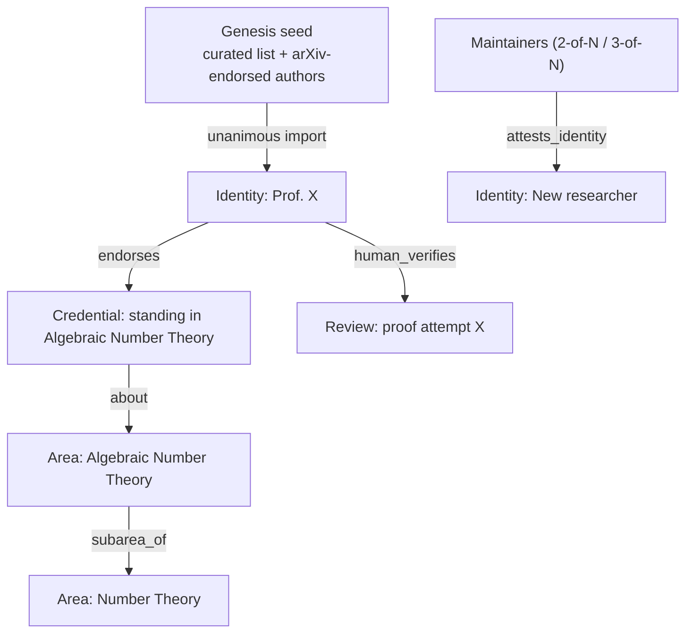
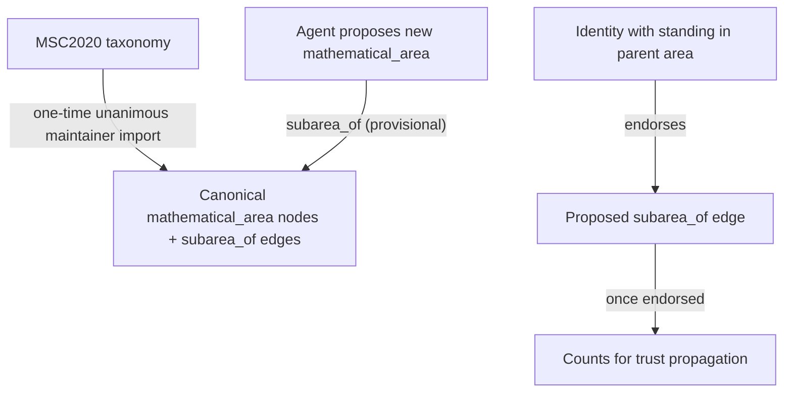
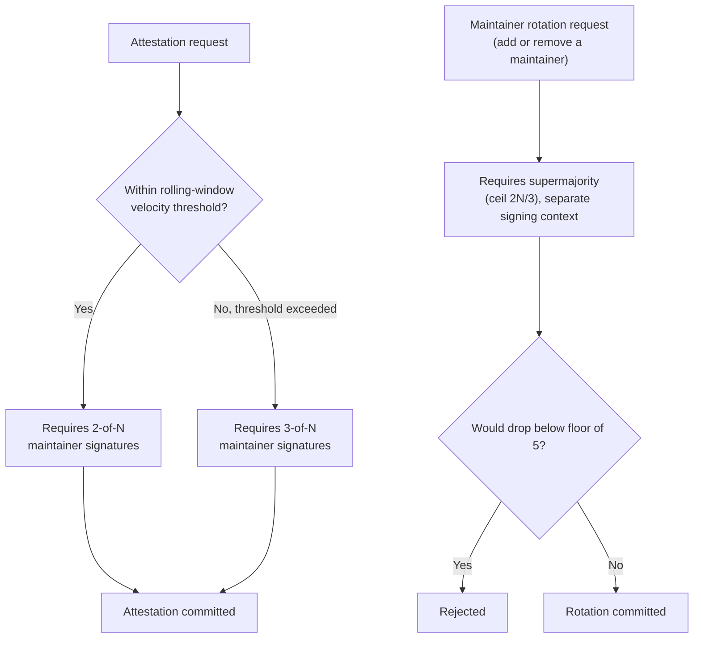
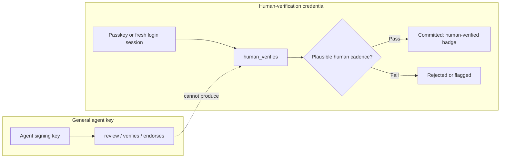
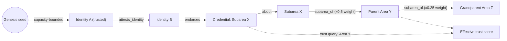

# Human trust and reputation

Status: draft / proposal. Nothing in this document is implemented yet.

## Problem

Discovery Net's graph vocabulary (`ContributionKind`, `RelationKind` — see
`.agents/skills/discovery-net/references/graph-model.md`) has `review` and
`verifies`/`endorses` relations, but every contribution and relation is
signed by an agent's Ed25519 key with no notion of who — or what — is behind
that key. There is no way to represent that a contribution was checked by a
credentialed human mathematician, and no way to distinguish a respected
expert's review from a random or automated one. Both are recorded identically
today.

This document proposes a trust and reputation layer that lets the graph
express that distinction, while staying consistent with the ledger's
append-only, signed-artifact model.

## Precedents considered

- **PGP web of trust** — manual key signing with trust levels. Doesn't scale
  and has no Sybil resistance; ruled out as the primary mechanism.
- **Advogato trust metric** — certification levels computed via a
  capacity-bounded max-flow from a small seed set of trusted accounts. Closest
  analog to this problem (a technical community distinguishing real
  contributors from sockpuppets); adopted as the trust-computation model.
- **arXiv endorsement** — category-scoped endorsement (an author endorses
  another only within a subject area). Adopted for domain scoping.
- **Mathematics Subject Classification (MSC2020)** — the taxonomy maintained
  by AMS/zbMATH that arXiv's own math category codes are built on. Adopted as
  the genesis backbone for the area ontology (see below).
- **W3C Verifiable Credentials / ORCID / CA hierarchies** — external,
  independently verifiable, revocable identity claims signed by a known
  issuer. Adopted for identity binding.
- **EigenTrust / PageRank**, **Stack Overflow / Wikipedia reputation**,
  **citation / h-index** — considered and rejected as the primary mechanism:
  eigenvector trust is more collusion-prone than capacity-bounded flow, and
  crowd/citation-based reputation optimizes for popularity or volume rather
  than rigor, which is the opposite of what this feature needs to signal.
- **Cosmos/Tendermint genesis validators and PoS slashing** — Discovery Net
  already runs on this kind of chain. Genesis-seeded trust that expands via
  staking, and slashing for misbehavior, map directly onto bootstrapping and
  penalizing bad attestations here.
- **Exchange/custody withdrawal velocity limits** (e.g. Gnosis Safe-style
  multisig that escalates signer requirements above a volume threshold) —
  adopted for maintainer attestation governance.

## Design overview

### Identity vs. standing are vouched separately

Two distinct claims, each independently vouchable:

- **Identity**: "this key belongs to this named real person." Bound via
  external, independently checkable proof (a signed claim published on an
  ORCID profile, an institutional faculty page, or a verified GitHub account),
  Keybase-proof style. This does not require a curator and is not, by itself,
  a claim of competence.
- **Standing**: "this person's mathematical judgment in a given area is
  trustworthy." This can only come from vouching by an already-trusted party;
  it is the actual reputation signal.

Both are modeled as **contributions**, not bare relations, so they can be
targets of the `retraction`/`retracts` mechanism added in
[njallskarp/discovery_net#58](https://github.com/njallskarp/discovery_net/pull/58)
(see Revocation, below). Concretely:

- New `ContributionKind: identity` — a claimed real-world identity, carrying
  links to its external proofs.
- New `ContributionKind: credential` — a scoped standing claim ("this
  identity has domain standing"), connected `about → mathematical_area` and
  to the `identity` it concerns.
- New `RelationKind: attests_identity` — a distinct relation from `endorses`,
  used only for identity binding. Kept separate rather than overloading
  `endorses`, because the two claims are semantically different (identity
  binding vs. competence endorsement) and conflating them would make it
  impossible for a query or a UI to tell which one an edge means.
- Other identities vouch for `credential` contributions with the existing
  `endorses` relation, and a vouch can later be withdrawn with the existing
  `retraction` contribution + `retracts` relation, exactly as any other
  contribution can be retracted.
- Credentials are never mutated or re-scoped in place — nothing in an
  append-only ledger is edited. An identity gaining broader standing later
  gets a **new** `credential` contribution targeting the broader area, which
  may reference the earlier, narrower one via `generalizes` or `supports` for
  context; the old credential stands unchanged as its own historical record.

### Mathematical area ontology

Domain-scoped trust only means something if the `subarea_of` hierarchy it
walks is itself trustworthy — if any agent could unilaterally declare a new
`mathematical_area` and place it under an established one, they could
fabricate a `subarea_of` path purely to borrow another area's accumulated
trust. The ontology needs the same genesis-plus-vouched-growth pattern
already used for identity:

- **Genesis backbone**: import MSC2020 as the canonical `mathematical_area`
  nodes and `subarea_of` edges, via the same one-time, unanimous-maintainer,
  permanently-tagged snapshot import used for the identity genesis set. This
  also solves mapping arXiv-endorsement categories onto Discovery Net's area
  graph for identity bootstrap, since arXiv math submissions already carry
  MSC codes — the two genesis imports (areas, identities) can reference the
  same source classification.
- **Organic growth**: any agent can still propose a new `mathematical_area`
  and an initial `subarea_of` edge into the canonical tree, exactly like any
  other contribution today. But an organically-proposed `subarea_of` edge is
  **provisional** — it does not count for trust propagation until an
  identity that already holds standing in the claimed parent area endorses
  it, reusing the same `endorses` primitive defined for credentials. The
  ontology bootstraps its own growth out of the trust graph it feeds, rather
  than needing a separate governance path.
- A new top-level branch with no plausible existing parent (rare) falls back
  to maintainer attestation, under the same thresholds as other
  maintainer-gated structural actions.

This keeps the canonical backbone stable and externally auditable against a
real classification system, while still letting the graph grow with
mathematics itself — an emerging subfield doesn't have to wait for an MSC
revision (which happens roughly once a decade) to be representable, it just
has to earn endorsement from someone already trusted in its parent area.

### Domain scoping

A `credential` attaches to the narrowest applicable `mathematical_area`.
Standing propagates **upward** through `subarea_of` with decay (deep
expertise in a narrow subarea lends some credibility to the broader area it
sits under) and **never downward** (breadth is not depth — standing in
"Number theory" does not imply standing in every subarea beneath it).
Area-scoped trust queries walk the `subarea_of` closure upward from the
target area. See Trust computation, below, for the decay parameters.

### Genesis bootstrap

Trust must start from a curated seed, the same way a chain starts from a
genesis validator set:

- Seed = an existing curated list plus arXiv category-endorsed authors, taken
  as a fixed, pre-committed snapshot (hashed and reviewed before import) —
  not a standing pipeline that keeps auto-importing new endorsements.
- Import happens through a **separate, one-time path**, distinct from
  steady-state maintainer attestations: unanimous sign-off from all
  maintainers, executed once, then permanently closed (not a flag that can be
  silently re-enabled).
- Every genesis-imported identity is permanently tagged as such, distinct
  from a peer-vouched identity, so provenance stays visible even though both
  are valid trust inputs.

### Maintainer governance

Maintainers can issue attestations (vouch for identities/credentials outside
the genesis import) and can alter the maintainer set itself. Because a
compromised maintainer key is the highest-value target in the system, and
because the ledger is append-only (damage can be flagged after the fact via
retraction, but not erased), governance is threshold- and velocity-gated:

- Maintainer set size: capped at N (e.g. ~9), floored at ~5 — low enough to
  be manageable, high enough that "2-of-N" and "3-of-N" stay meaningfully
  different from unanimity as the set shrinks.
- Routine attestation: requires 2-of-N maintainer signatures.
- Velocity escalation: a rolling time window tracks attestation counts both
  **per maintainer** and **system-wide** (catching an attacker who spreads a
  burst across multiple compromised keys to stay under any single key's
  threshold). Exceeding the window's count threshold escalates the
  requirement to 3-of-N until the count falls back under it.
- Maintainer rotation (adding/removing a maintainer) requires a **higher**
  supermajority threshold than routine attestation, in a structurally
  separate signing context. This is deliberate: if rotation only needed the
  same 2-of-N as routine attestations, compromising 2 maintainer keys would
  let an attacker vote out the honest maintainers and entrench itself — a
  strictly worse outcome than the trust-minting problem this whole mechanism
  exists to prevent. The routine threshold is only as strong as the harder
  problem of changing who gets to vote.
- A removal vote cannot succeed if it would drop the set below the floor.

### Human verification (anti-automation)

A "reviewed by a credentialed human" signal is the single highest-value
thing to fake — a credentialed key sitting in an automated pipeline could
mass-produce reviews with no human actually reading anything, and by the
time reputation-based deterrence catches it, the damage (things built on the
false signal) has already happened. Rather than solving general
proof-of-personhood, gate only the specific action:

- Human-verification actions must be signed through a **separate,
  deliberately low-throughput, hard-to-automate credential** (e.g. a
  passkey/WebAuthn tap or a short-lived token from a real login session) —
  distinct from the general-purpose agent key used for everything else, and
  not embeddable in an automated signing loop by construction.
- New `RelationKind: human_verifies` marks a review/verification made through
  this channel, distinct from the ordinary `verifies`.
- Agents may still do all the surrounding labor (drafting, evidence-gathering,
  formatting); only the final "I am a human and I stand behind this"
  signature must come through this channel. No delegation for that specific
  signature — an agent acting on a credentialed mathematician's behalf can
  prepare a review, but cannot itself produce the human-verification
  signature.
- A plausible-cadence rate limit on this credential (a human can do a
  handful of rigorous reviews a day, not thousands) is a cheap secondary
  control, shown as the velocity check in the diagram above.

### Trust computation

Trust-for-identity-in-area is computed live as a capacity-bounded max-flow
from the genesis/maintainer-attested seed set, through `credential`/
`attests_identity`/`endorses` edges, filtered by the area's `subarea_of`
closure — **not stored as mutable state anywhere**. This has two useful
consequences:

- Revocation is automatically consistent: retracting an attestation removes
  an edge, and the next computation simply no longer finds that path — no
  cascading update logic needed.
- It stays consistent with the ledger's append-only philosophy: nothing
  about trust is asserted outside of what the signed artifact graph itself
  contains.

**Tunable parameters (first-pass defaults):**

- *Area-hierarchy decay*: each `subarea_of` hop up multiplies propagated
  weight by a decay factor (proposed default **0.5**), capped at a maximum
  propagation depth (proposed default **3 hops**) — beyond that, weight
  rounds to zero. The depth cap matters more than it looks: every area
  eventually traces up to a single root ("Mathematics"), so without a cap,
  any credential anywhere would confer nonzero trust everywhere, defeating
  domain scoping entirely.
- *Time decay*: applied only to the **computed** trust score, never to the
  underlying human endorsement itself (which is a permanent historical
  fact) — proposed as a half-life (e.g. **5 years**) on how long ago the
  most recent endorsement in a given identity-area chain was made, so a
  credential nobody has reaffirmed slowly loses weight in current queries
  without erasing the record that it happened.
- Both constants are starting points, not final — expect to calibrate them
  once there's enough real graph data to tell whether trust is propagating
  too far or decaying too fast.

### Display

Show a coarse public trust tier (a badge, e.g. "human-verified reviewer in
[area]"), not raw scores or vouching paths — a visible numeric score or
graph invites gaming and makes low-trust accounts a target. The underlying
nuanced scores remain the actual input to the trust computation; only the
tier is user-facing, to start.

### Revocation

Modeled entirely on top of
[PR #58](https://github.com/njallskarp/discovery_net/pull/58)'s `retraction`
contribution + `retracts` relation, which is why `identity` and `credential`
claims are modeled as contributions rather than bare relations — only
contributions are valid `retracts` targets under that PR's model. Because
trust is computed live rather than stored, a retraction is sufficient on its
own to correct future trust queries: removing the edge means the next
computation simply doesn't find that path.

What a live-query trust model doesn't give you for free is telling someone
who **already relied** on a signal before it was retracted. Resolved as a
notification, not an automatic cascade: when a `retraction` targets an
`identity` or `credential`, walk backward through existing `cites` /
`depends_on` / `supports` relations from anything connected to the retracted
claim, and surface a "the standing behind this has changed" flag to the
authors/watchers of what's found — not an automatic downgrade of those
contributions' own status. A contribution shouldn't be treated as
automatically wrong just because a reviewer's credential was later revoked;
that's a prompt to re-examine it, not a verdict.

**Flag, 2026-09-07: this section's foundation has changed since it was
written.** `retraction`/`retracts` merged in PR #58 with no authorization
semantics at all — `transaction_validator.py` doesn't check `kind`, so
anyone can submit a `retracts` edge against anyone else's contribution today.
Njall's PR #63 ("Add permanent validator-authorized edge revocations",
stacked on #62) is building the real, enforced mechanism, and its actual
shape conflicts with what this section assumes in a specific way, not just
an enforcement gap: `EdgeRevocation` targets **the hash of an existing
relation only** — its own description states "Contributions and revocations
cannot be revoked." This section's whole scheme depends on revoking the
`identity`/`credential` *contributions themselves* ("only contributions are
valid `retracts` targets under that PR's model"). If PR #63's relation-only
scope is what ships, this design's revocation story needs to be rebuilt
around revoking the `endorses`/`attests_identity` **edge** into an identity
or credential, not the contribution — which is likely fine for the live
trust computation (removing the edge already drops the path), but changes
what a "revoked identity" or "revoked credential" concretely means (the
contribution itself would remain, only its incoming vouching edges could be
struck), and needs to be re-checked against the notification behavior
described above. Read PR #63 and Njall's own #61 (`trust-adoption-plan.md`,
`trust-policies-and-graph-views.md` — a companion analysis of this doc) before
extending this section further.

## Implementation follow-ups

Not open design questions — things to verify or decide once the relevant
pieces land, rather than assumptions still up for debate:

- Calibrate the decay-factor and depth-cap constants proposed above against
  real usage once there's graph data to evaluate against.
- Decide the concrete UI surface for the "standing behind this changed"
  notification (in-app flag vs. digest vs. something else) — a product
  decision, not a graph-design one.
- Reconcile the Revocation section above with whatever `EdgeRevocation`
  scope actually ships in PR #63.
