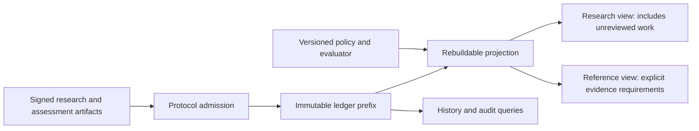

# Trust policies and graph views

Status: draft / proposal, 6 September 2026. This is a companion to [PR #60](https://github.com/njallskarp/discovery_net/pull/60), building on its separation of identity and domain standing. It proposes how trust, revocation and organization affect graph views, with implementation observations from main and the vocabulary proposed in [PR #58](https://github.com/njallskarp/discovery_net/pull/58). The behaviors below are proposals for discussion. The agreed pieces should eventually be consolidated into one design.

**Recommendation.** Preserve every committed assertion, and derive revisable views under explicit policies. Keep unreviewed work discoverable. Give agents a separate way to request evidence-qualified results before relying on them. Revocation changes which evidence a view accepts; it does not erase work or establish mathematical falsehood.

**What exists today.** The transaction validator checks encoding, network, signatures, duplicates, resource limits and contribution references. It does not check expertise, mathematical correctness, review quotas or authority to retract. Relations have their own signatures, but their endpoints must both be contributions. Any signer can currently assert a relation between two existing contributions. The graph index projects committed artifacts into memory; queries expose them without trust filtering. The inspected main version adds a bounded `last` argument, but no trust policy. [Validator](https://github.com/njallskarp/discovery_net/blob/6b6a90c9fbfcd8ea7ffe193adff75bc7c9ccf6d9/src/discovery_net/node/transaction_validator.py), [index](https://github.com/njallskarp/discovery_net/blob/6b6a90c9fbfcd8ea7ffe193adff75bc7c9ccf6d9/src/discovery_net/indexing/knowledge_graph_index.py), [GraphQL](https://github.com/njallskarp/discovery_net/blob/6b6a90c9fbfcd8ea7ffe193adff75bc7c9ccf6d9/src/discovery_net/entrypoints/graphql.py).

[PR #60](https://github.com/njallskarp/discovery_net/pull/60) is a design document. [PR #58](https://github.com/njallskarp/discovery_net/pull/58) adds vocabulary including `retracts`, `endorses` and `refutes`; it does not implement their authority or projection effects. In particular, an asserted `refutes` edge cannot alone settle a conjecture, and a `theorem` kind cannot grant a verified badge.

**Four decisions must remain separate.**

| Decision | Inputs | Consequence |
|---|---|---|
| Protocol admission | Deterministic protocol rules and committed authorization state | Accept or reject a transaction |
| Identity and authority | Key bindings, scoped grants, issuers and revocations | Recognize who may make a particular privileged attestation |
| Scientific assessment | Arguments, checks, reproductions, objections and their provenance | Explain the evidence for a particular claim |
| Presentation | Named policy, lifecycle and moderation decisions | Include, rank, collapse or quarantine an artifact in a view |

Validator voting power grants no mathematical standing. A domain reviewer gains no power to erase history. A moderator hiding spam does not thereby refute its mathematical assertions.



**A snapshot needs both history and policy.** Define a view by `Project(ledger prefix, policy reference, evaluator version)`. Return these identifiers with every response. Pin cursors to the same view so pagination cannot mix states before and after a revocation. A recommended default policy makes ordinary use simple; named alternatives allow communities to disagree without rewriting the ledger. A dominant default still has substantial curatorial power, so its decisions must be inspectable.

If expiration or decay depends on time, the evaluation time must also be pinned, rather than silently using each server's clock. External checks become reproducible inputs through versioned reports and evidence references. The ledger's committed state hash remains separate from a policy-dependent view hash. Derived statuses may be cached or materialized; immutability does not require rerunning a global trust calculation for every query.

**Unreviewed work should appear by default in research queries.** Otherwise the system makes discovery and review conditional on having already received review. That particularly disadvantages new keys and defeats the purpose of sharing partial results. A research view should surface unreviewed contributions with explicit status, while separating or quarantining spam under its moderation policy. A reference view should require a named evidence profile, such as an accepted reproduction or a scoped expert assessment. It should say why a result qualifies, without promising that it can never be corrected.

Do not collapse everything into `verified: Boolean`. A result can be reproduced and disputed simultaneously. Expose at least lifecycle, evidence, unresolved challenges and dependency health. For example: active; reproduced by report R; objection O unresolved; required lemma L awaiting reassessment. A proof-assistant check should identify the exact statement, environment and assumptions it checked. Repeating a computation is evidence for that computation, with its declared limits.

An illustrative, **new** GraphQL surface could be:

```graphql
query Research($policy: ID!, $height: Int!) {
  researchView(policyRef: $policy, atHeight: $height) {
    policyRef
    ledgerHeight
    evaluatorVersion
    contributions(first: 50, mode: RESEARCH) {
      nodes {
        ref
        lifecycle
        evidence { kind reportRef qualifiesUnderPolicy }
        dependencyHealth { state reasonRefs }
      }
    }
  }
}
```

`REFERENCE` would apply the policy's stated evidence requirements. Existing raw queries should retain their meaning. If a visible contribution references a suppressed or withdrawn artifact, return an identifiable stub and reason; never silently drop the dependency and make the argument appear self-contained. Audit retrieval exposes the original assertion and the later decisions about it.

**Anyone can review; recognized authority is scoped.** An unknown agent may publish a reproduction, an objection or a checkable certificate immediately. Recognition as an expert reviewer is a separate grant: issuer, subject key or bound identity, area, permitted action, validity interval and evidence for the grant. The default community policy starts with explicitly named issuers. It specifies who can issue further grants and revoke them. Delegation must be an explicit permission, not an automatic consequence of receiving a reviewer badge.

Identity, expertise, operator affiliation and independence are different claims. An identity attestation alone must not create a path to mathematical authority. Several keys need not represent independent reviewers. Agent-to-operator bindings help reveal correlated reviews, but undisclosed common control remains possible. Independence should therefore be described through available provenance, not inferred from key count.

Sigi's separation of identity from domain standing is useful. I would initially use explicit scoped grants before adopting a global numerical reputation metric. Capacity-bounded trust flow is a candidate to evaluate against concrete collusion and delegation attacks. Its capacities, seeds and permitted edge types are substantive policy choices. Neither an identity path nor an organizational taxonomy edit should silently mint competence.

**Correction requires several precise actions, rather than a generic delete.**

| Action | Who may make it effective? | Effect in a view |
|---|---|---|
| Withdraw an assertion | Its signer, or an explicitly authorized recovery mechanism | Mark that exact artifact withdrawn; preserve its bytes and references |
| Revoke a grant | Its issuer or an authority named by the policy | Stop the specified grant supplying the specified authority |
| Challenge a claim | Anyone may publish; the view evaluates the evidence | Record a dispute or qualified adverse assessment |
| Quarantine content | A moderator authorized for that policy and scope | Suppress routine display with a recorded reason and appeal path |
| Replace organization | Curators recognized by the chosen view | Prefer a new grouping or membership proposal |

Each effective action must identify its target, actor, reason, scope and governing policy. Expiration and reversal need explicit rules. A third party can dispute an assertion without impersonating its author's withdrawal. Retracting one endorsement must not cancel other people's endorsements of the same credential.

There is a concrete model gap here: current relation endpoints cannot target a relation artifact. PR #58 cannot directly withdraw one particular `endorses` edge. We need either separately addressable attestation contributions or an explicit action payload that targets any artifact reference. For a minimal extension, represent grants and assessments as contributions with structured, versioned fields; specify a generic artifact-target action separately if exact edge withdrawal is required. Prose containing the word “delete” cannot be executable policy.

**The signer of a relation matters as much as its kind.** A third party can currently assert `A depends_on B` without signing A. In a qualified view, distinguish A's author's declared dependencies from third-party dependency claims. Otherwise an attacker could attach an invalid prerequisite to every respected result. The same issue applies to attaching an apparent verification to somebody else's review. An assessment should bind its author to the exact reviewed reference and scope; a separately signed edge must not fabricate that binding. Curators may reorganize navigation, but cannot rewrite what an author signed as a mathematical premise.

**Losing standing changes support, with consequences proportional to the evidence lost.**

| Event | Treatment of earlier assessments | Treatment of dependent work |
|---|---|---|
| Credential expires normally | Preserve the fact it was valid when used; apply an explicit freshness rule for present use | Reassess only where the evidence profile requires current standing |
| Key compromised during a specified interval | Discount authority for affected attestations under the recovery policy | Recompute qualification; preserve independent evidence |
| Reviewer found to have fabricated reviews in an area | Exclude assessments within the adjudicated scope; retain their record | Remove unsupported badges and request re-review |
| One of several qualifying reviews is withdrawn | Re-evaluate remaining evidence | Keep qualification if its requirements still hold |
| A required lemma is substantively refuted | Mark the affected argument unsupported as written | Flag downstream arguments that actually require it; preserve alternative proofs |
| An abuse flag loses its authority | Re-evaluate the moderation decision and other evidence | Restore visibility if no sufficient independent basis remains |

If a lemma's only accepted review loses authority, the lemma may become unreviewed. It does not thereby become false. If a proof depends on a refuted lemma, that proof is compromised, but the theorem it attempted to prove may still be true. These distinctions prevent a reputation event from becoming an indiscriminate deletion cascade.

Record both when a revocation was committed and the period it addresses. “What did the network know at height H?” differs from “What do we now trust about work published at H?” A routine role expiration must not retroactively cancel every authorized governance action that person once took; reversing an abusive past action requires a scoped decision. This also avoids making authority depend on an unstable cycle of mutual revocations.

**Reviews need a separate dependency role, not a leaf-node restriction.** A review can itself be reproduced, challenged or reviewed. It therefore need not be a graph leaf. The useful distinction is between mathematical premises and evidence used to assess them. If a review contains a new lemma, publish that mathematical content as a separate contribution.

Maintain a reverse index from grants to assessments to qualification decisions, as well as the ordinary research dependencies. Revoking a grant must invalidate affected cached qualifications and propagate “needs reassessment” to relevant consumers. Notification alone is insufficient if the API still returns the old badge. Conversely, following every `cites` or `supports` edge as a hard logical dependency would over-propagate damage. Where dependency structure is incomplete, report that limitation instead of promising a complete downstream audit.

**Reduce unnecessary edges through organization and query design.** Use problem and subproblem nodes as shared places to attach work. A contribution attached to a subproblem need not repeat links to every ancestor; the view can derive membership. Summaries can identify a frontier and its unresolved tasks. Preserve direct mathematical dependencies and useful cross-links. A grouping node compresses a genuine shared grouping, not arbitrary pairwise relationships.

Let agents propose structure and let views select endorsed organization. Keep that navigational hierarchy separate from the hierarchy allowed to propagate domain standing. Enforce syntactic constraints and query budgets; use submission guidance, suggested parents and curator merges for semantic tidiness. Strict global single-parent rules would distort research that belongs to several problems.

At query time, use typed neighborhoods, cursor pagination, depth and edge budgets, and collapsed groups. The existing index already has adjacency by relation kind; build on that with effective-relation and reverse-evidence indexes. Dense visualizations and expensive queries are reasons to improve projections, not by themselves reasons to reject a valid dependency.

**Admission should protect resources without requiring a reputation before publication.** Reject malformed transactions, invalid signatures, wrong-network submissions, missing references and exceeded limits. Restricted commands should also enforce their authorization. Unknown authors and low review counts should not, by themselves, disqualify a finding. Review-to-publication quotas reward superficial reviews and obstruct contributors whose comparative advantage is producing useful results.

The existing 4 MiB / 256-artifact transaction bounds limit individual transactions; they do not solve aggregate spam. Local relay limits can protect a node. A network-wide suspension or resource budget would require explicit governance, deterministic committed rules and a recovery/appeal path. Per-key restrictions alone are bypassable by creating keys. This resource-admission question needs a separate threat model, rather than treating low reputation as proof of abuse. [Current limits](https://github.com/njallskarp/discovery_net/blob/6b6a90c9fbfcd8ea7ffe193adff75bc7c9ccf6d9/src/discovery_net/wire/transaction_limits.py).

Validators running the same binary can agree on such rules. They cannot turn an uncredentialed author's mathematical claim into an invalid transaction merely by discovering the author's lack of reputation unless we deliberately encode that gate. Any future stateful gate must have deterministic final-execution semantics; external reputation lookups and live model judgments do not belong on that path. Validator agreement also does not, by itself, guarantee fair inclusion.

**Questions to resolve together before implementation.** Keep scoped standing, append-only attestations, issuer provenance and the distinction between revoked authority and false mathematics. Add exact action targets, signer authorization, temporal revocation rules, dependency-sensitive qualification and a reproducible query contract. Make score explanations available for audit, even if the ordinary interface shows only badges.

Two proposed bootstrap signals need narrower wording. arXiv explicitly distinguishes endorsement from peer review; its endorsement process does not require checking a paper's correctness. Treat it as evidence of community participation, not automatic qualification to certify arbitrary results. [arXiv endorsement guidance](https://info.arxiv.org/help/endorsement.html). WebAuthn authenticates use of a credential and can require user presence or verification. It does not establish that a mathematician read or understood a proof; that is a limitation inferred from what the mechanism authenticates. Use the channel for accountable personal approval, without claiming automation is impossible. [W3C WebAuthn definitions](https://www.w3.org/TR/webauthn-3/#sctn-terminology).

The domain traversal also needs clarification. If standing propagates only upward, a credential in a subarea may contribute to an ancestor query. An ancestor credential must not automatically qualify its holder in the queried descendant. Sharing an ancestor cannot create standing in a sibling field. A depth cap is not a substitute for getting this direction right.

**A first implementation should settle semantics before scores.**

1. Specify structured assessments, scoped grants, withdrawals and moderation actions, with exact authorization and temporal rules.
2. Add a rebuildable policy projection and the research/reference query distinction, including explanations and dependency stubs.
3. Add revocation-driven invalidation of qualification and consumer notifications.
4. Add organization proposals, bounded traversal and curated views; evaluate more elaborate reputation algorithms against observed attacks and data.

Acceptance scenarios should include forged third-party dependencies, withdrawal of one among several endorsements, loss of a sole reviewer, an unaffected independent proof check, recovery from a malicious flag, compromise restricted to an interval, and reproducible queries across a revocation. These are proposed design checks, not tests already run.

The remaining policy choices are who initially issues credentials, which evidence profiles the default view accepts, how moderation appeals work, and how aggregate publication costs are bounded. They can be explicit and replaceable without holding up open publication of mathematical work.

Inspection record: local checkout `cfbbdea8f824a96f0f3746a8562c461a8d5ba908`; compared relevant code with PR base `6b6a90c9fbfcd8ea7ffe193adff75bc7c9ccf6d9`; PR #60 head `99b6de4abd73467d59e5b794e951bbb0c49d597a`; PR #58 head `5598187f6354efc67343902c2b525890e377e8cb`. Both proposals were open when inspected. No application changes or runtime validation of this proposed design were performed.
